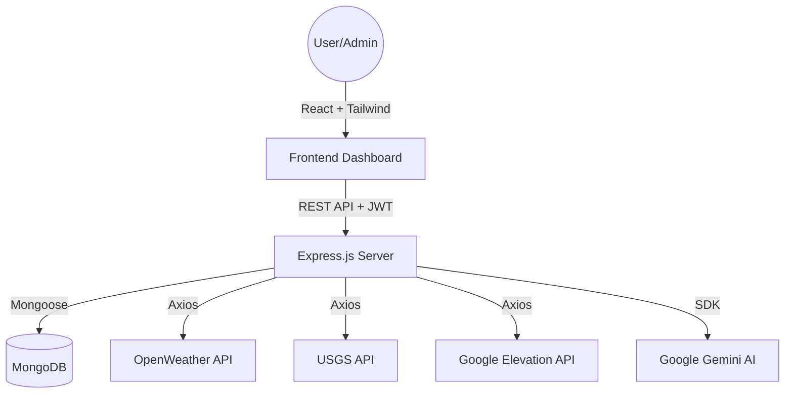
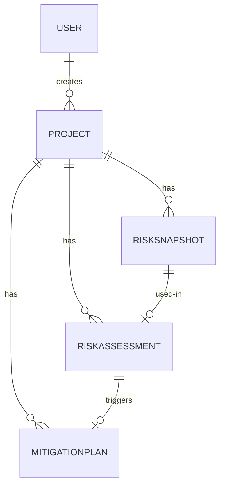

# Disaster Resilience Risk System (DRRS) 🏗️🛡️

A data-driven infrastructure resilience platform designed to assess, analyze, and mitigate disaster risks using real-time environmental data and AI-powered recommendations.

---

## 👥 The Team (Group 12)

| Component | Responsibility | Lead Developer |
| :--- | :--- | :--- |
| **Component 1** | Identity & Infrastructure Management | **Kanesamoorthy Saayinath** |
| **Component 2** | Environmental Risk Data Pipeline | **Jesuthasan Jathusan** |
| **Component 3** | Intelligent Risk Assessment Engine | **Shanchika Sivalingam** |
| **Component 4** | AI-Driven Mitigation & Recovery | **Tharsiga Ranganathan** |

---

## 📐 System Architecture

---

## 🧩 Component Deep-Dive

### 1. Identity & Infrastructure Management (Comp 1)
**Developer: Kanesamoorthy Saayinath**
- **Identity Lifecycle**: Secure registration, login, and email verification via 6-digit OTP.
- **Geocoding integration**: Automated conversion of site addresses into precise GPS coordinates (Latitude/Longitude) for risk mapping.
- **Role-Based Access**: Granular control differentiating between Administrative oversight and Contractor site-management.

### 2. Environmental Risk Data Pipeline (Comp 2)
**Developer: Jesuthasan Jathusan**
- **Live Environmental Snapshots**: Real-time extraction of weather metrics (rainfall, wind, temperature) via OpenWeather.
- **Seismic Monitoring**: Automatic historical lookup of earthquakes within a variable radius (default 200km) using the USGS API.
- **Data Persistence**: Versioned "snapshots" that freeze site conditions for future auditability.

### 3. Intelligent Risk Assessment Engine (Comp 3)
**Developer: Shanchika Sivalingam**
- **Weighted Assessment Algorithm**: A sophisticated scoring engine that calculates a 0-100 risk score based on multi-hazard input.
- **Elevation-Aware Scoring**: Integrates Google Elevation API to adjust flood risk based on the site's vertical profile.
- **Historical Benchmarking**: Tracks risk trend progression over time for a single infrastructure asset.

### 4. AI-Driven Mitigation & Recovery (Comp 4)
**Developer: Tharsiga Ranganathan**
- **Generative AI Strategy**: Leverages Google Gemini 1.5 Flash to generate contextual mitigation tasks based on site-specific risks.
- **Interactive Kanban Board**: Dynamic status management (Pending/Ongoing/Completed) for mitigation tasks.
- **Executive Reporting**: Automated generation of professional PDF summaries for stakeholder review.
- **AI Co-pilot**: Integrated chat companion for quick site-safety queries.

---

## 🔐 Database Design (ERD)

---

## 🚦 Full API Catalog (No-Miss Reference)

### 🔑 Authentication
| Method | Endpoint | Access | Description |
| :--- | :--- | :--- | :--- |
| `POST` | `/api/auth/register` | Public | Register new user + trigger OTP |
| `POST` | `/api/auth/verify-email` | Public | Verify account via OTP |
| `POST` | `/api/auth/login` | Public | Receive JWT Token |
| `POST` | `/api/auth/forgot-password`| Public | Initiate password reset flow |
| `POST` | `/api/auth/reset-password` | Public | Reset password via OTP |
| `GET` | `/api/auth/me` | User | Get current session user data |

### 📁 Project Management
| Method | Endpoint | Access | Description |
| :--- | :--- | :--- | :--- |
| `POST` | `/api/projects` | User | Create project with auto-geocoding |
| `GET` | `/api/projects` | User | List user's projects (Pagination/Search) |
| `GET` | `/api/projects/:id` | Owner | Get full project metadata |
| `PUT` | `/api/projects/:id` | Owner | Update project details (Date/Budget) |
| `PATCH`| `/api/projects/:id/status`| Admin | Approve/Reject Project Status |
| `GET` | `/api/projects/maps-api-key`| User | Securely fetch client-side API key |

### 🌍 Environmental Risk Data
| Method | Endpoint | Access | Description |
| :--- | :--- | :--- | :--- |
| `POST` | `/api/risk-data/fetch/:pid`| Owner | Fetch live OpenWeather/Seismic data |
| `GET` | `/api/risk-data/:pid/latest`| Owner | Get most recent data snapshot |
| `GET` | `/api/risk-data/:pid/history`| Owner | View all historical snapshots |
| `DELETE`| `/api/risk-data/:sid` | Admin | Purge specific data records |

### 📊 Assessment Engine
| Method | Endpoint | Access | Description |
| :--- | :--- | :--- | :--- |
| `POST` | `/api/assessments/run/:pid` | Owner | Trigger risk calculation engine |
| `GET` | `/api/assessments/:pid/latest`| Owner | Get current risk levels/scores |
| `GET` | `/api/assessments/:pid/history`| Owner | View asset risk history |
| `DELETE`| `/api/assessments/:id` | Admin | Delete assessment records |

### 🛡️ Mitigation & Recovery
| Method | Endpoint | Access | Description |
| :--- | :--- | :--- | :--- |
| `POST` | `/api/mitigation/generate/:pid`| Owner | Generate AI Mitigation Plan |
| `GET` | `/api/mitigation/all` | Admin | View all system-wide plans |
| `PATCH`| `/api/mitigation/:planId/recommendations/:recId` | Owner | Update task status locally |
| `POST` | `/api/mitigation/chat` | User | Consult AI Safety Companion |

---

## 🧪 Quality Assurance & Performance

### 1. Test Coverage (40+ Tests)
The system uses **Jest** and **Supertest** for a robust quality gate.
- **Unit Tests**: Domain logic testing for scoring and planners.
- **Integration Tests**: Full service-to-database path verification.
- **Mocking**: External APIs (Gemini/Weather) are mocked to ensure 100% deterministic test results.

### 2. Load Testing (Artillery)
Performance was validated under sustained load (10 users/sec).
- **Mean Response Time**: 327ms
- **P95 Latency**: **376ms**
- **Success Rate**: 100% (No dropped connections).

---

## 🚀 Setup & Installation

### Local Backend Configuration:
1. `cd backend && npm install`
2. Create `.env` with:
   - `MONGO_URI`, `JWT_SECRET`, `GEMINI_API_KEY`, `OPENWEATHER_API_KEY`, `GOOGLE_MAPS_API_KEY`.
3. `npm run dev`

### Local Frontend Configuration:
1. `cd frontend && npm install`
2. Configure `VITE_API_BASE_URL` in `.env`.
3. `npm run dev`

---
*© 2026 Disaster Resilience Risk System Team. Final Submission - Evaluation 02.*
