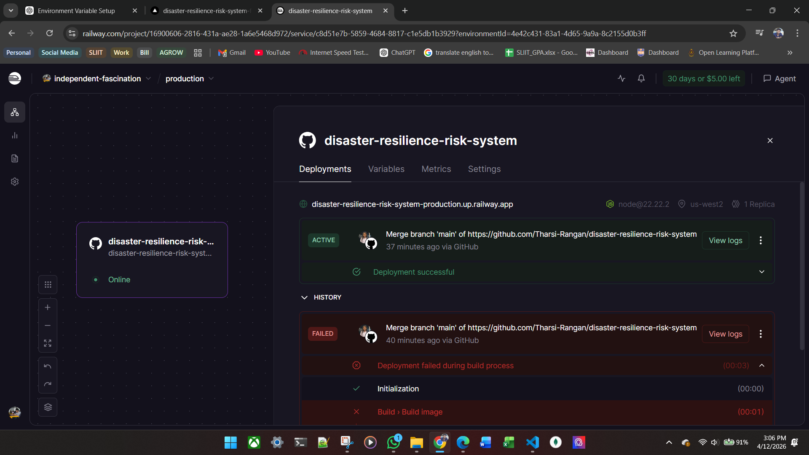
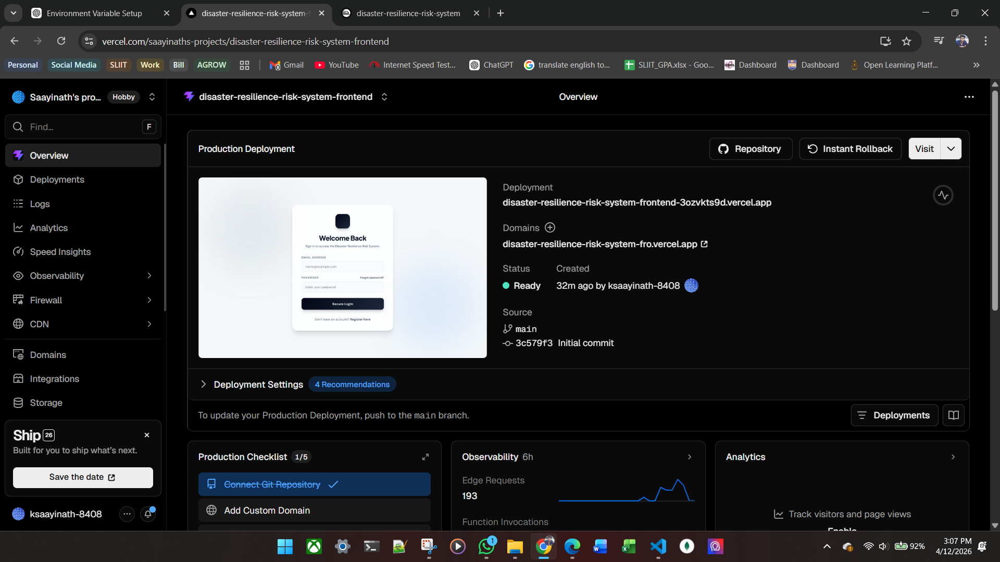

# Disaster Resilience Risk System (Backend)

## 📌 Project Overview

The Disaster Resilience Risk System is a secure RESTful backend application developed using **Node.js (Express.js)** and **MongoDB**.

The system helps contractors assess disaster risks (floods, earthquakes, weather hazards) before initiating infrastructure projects. It provides automated risk scoring and AI-based mitigation recommendations.

This project is developed for **SE3040 – Application Frameworks**.

---

## 🧱 Technology Stack

* Backend Framework: Express.js
* Database: MongoDB (Mongoose ODM)
* Authentication: JWT (JSON Web Token)
* Password Hashing: bcrypt
* Email Service: Nodemailer
* API Testing: Postman
* Version Control: Git & GitHub

### Justification

* **Express.js** provides a lightweight and scalable REST architecture.
* **MongoDB** supports flexible document-based storage for hazard and risk datasets.
* **JWT** ensures stateless secure authentication.
* Service-layer architecture improves maintainability and separation of concerns.

---

## 🏗️ System Architecture

The system follows a **Layered Architecture Pattern**:

Routes → Controllers → Services → Models → MongoDB

### Components

1. Authentication Module (Shared Security Layer)
2. Project Management Component
3. Disaster Risk Data Component
4. Risk Assessment Engine
5. Mitigation & Recommendation Component

---

## 📊 Database Design

### Collections

### 1️⃣ Users

* name
* email
* password (hashed)
* role (ADMIN / CONTRACTOR)
* isVerified
* OTP fields

### 2️⃣ Projects

* title
* description
* projectType
* location (address, lat, lng)
* status
* createdBy

### 3️⃣ RiskSnapshots

* projectId
* rainfall
* windSpeed
* earthquakeCount
* floodRiskIndex
* fetchedAt

### 4️⃣ RiskAssessments

* projectId
* snapshotId
* riskScore
* riskLevel
* weatherScore
* floodScore
* earthquakeScore

### 5️⃣ MitigationPlans

* projectId
* assessmentId
* recommendations
* priorityLevel

---

## 🔐 Authentication & Authorization

* JWT-based authentication
* Role-based access control
* Protected routes middleware
* OTP email verification

Roles:

* ADMIN → Full system control
* CONTRACTOR → Project and risk operations

---

## 🔄 REST API Design

🔐 Auth Routes

* POST /api/auth/register
* POST /api/auth/verify-email
* POST /api/auth/login
* POST /api/auth/forgot-password
* POST /api/auth/reset-password

📁 Project Routes

POST /api/projects

GET /api/projects

GET /api/projects/:id

PUT /api/projects/:id

DELETE /api/projects/:id

🌍 Risk Data Routes

POST /api/risk-data/fetch/:projectId

GET /api/risk-data/:projectId/latest

GET /api/risk-data/:projectId/history

📊 Assessment Routes

POST /api/assessments/run/:projectId

GET /api/assessments/:projectId/latest

GET /api/assessments/:projectId/history

🛡 Mitigation Routes

* POST /api/mitigation/generate/:projectId
* GET /api/mitigation/:projectId/latest
* GET /api/mitigation/:projectId/history
🔐 Auth Routes

POST /api/auth/register

POST /api/auth/verify-email

POST /api/auth/login

POST /api/auth/forgot-password

POST /api/auth/reset-password

📁 Project Routes

POST /api/projects

GET /api/projects

GET /api/projects/:id

PUT /api/projects/:id

DELETE /api/projects/:id

🌍 Risk Data Routes

POST /api/risk-data/fetch/:projectId

GET /api/risk-data/:projectId/latest

GET /api/risk-data/:projectId/history

📊 Assessment Routes

POST /api/assessments/run/:projectId

GET /api/assessments/:projectId/latest

GET /api/assessments/:projectId/history

🛡 Mitigation Routes

POST /api/mitigation/generate/:projectId

GET /api/mitigation/:projectId/latest

GET /api/mitigation/:projectId/history

DELETE /api/mitigation/:id

All routes follow standard HTTP status conventions:

* 200 – Success
* 201 – Created
* 400 – Bad Request
* 401 – Unauthorized
* 403 – Forbidden
* 404 – Not Found
* 500 – Server Error

---

## 🌐 Third-Party API Integrations

Each component integrates at least one external API:

1. Projects → Google Geocoding API (address to coordinates)
2. Risk Data → OpenWeather API (weather metrics)
3. Assessments → Elevation API (improves flood risk scoring)
4. Mitigation → OpenAI / Gemini API (AI-based recommendations)

These integrations satisfy the “Additional Feature” requirement.

---

## 🧪 Validation & Error Handling

* Express-validator for request validation
* Centralized error middleware
* Proper HTTP status codes
* Meaningful JSON error responses

---

## 📂 Project Structure

```
src/
 ├── controllers/
 ├── services/
 ├── models/
 ├── routes/
 ├── middleware/
 ├── utils/
 ├── config/
 └── server.js
```

This ensures:

* Separation of concerns
* Maintainability
* Scalability

---

## 🚀 Deployment

This project is deployed as two independent production services from the same monorepo:

* Backend API: Railway
* Frontend application: Vercel

The deployment is split this way so the Express API can scale independently from the React frontend, while the frontend can use static hosting and client-side routing support.

### Backend Deployment Setup

Platform: Railway

Setup steps:

1. Create a new Railway service from the repository.
2. Set the service root to the `backend` folder.
3. Ensure the Node.js app starts from the backend entry point used by the repository.
4. Add the required environment variables in Railway.
5. Deploy the service and confirm the API responds successfully.

Backend environment variables:

* Required: `MONGO_URI`, `JWT_SECRET`
* Optional, depending on enabled features: `EMAIL_FROM`, `EMAIL_USER`, `GOOGLE_MAPS_API_KEY`, `GOOGLE_ELEVATION_API_KEY`, `OPENWEATHER_API_KEY`, `GEMINI_API_KEY`, `AI_PROVIDER`, `OTP_EXPIRE_MIN`, `RISKDATA_MIN_FETCH_INTERVAL_MIN`

### Frontend Deployment Setup

Platform: Vercel

Setup steps:

1. Create a separate Vercel project for the `frontend` folder.
2. Set the build command to `npm run build`.
3. Use `dist` as the output directory.
4. Keep the SPA rewrite defined in `frontend/vercel.json` so React Router routes continue to work on refresh.
5. Add the frontend environment variable in Vercel.
6. Deploy the project and verify the application loads and connects to the backend API.

Frontend environment variable:

* `VITE_API_BASE_URL=https://disaster-resilience-risk-system-production.up.railway.app/api`

### Live URLs

* Frontend application: https://disaster-resilience-risk-system-frontend-3ozvkts9d.vercel.app
* Backend API: https://disaster-resilience-risk-system-production.up.railway.app

### Evidence of Successful Deployment

Deployment success was verified using the hosting dashboards and production URLs shown above.

* Vercel production deployment: frontend service is live and accessible from the generated Vercel URL.
* Railway production deployment: backend service shows an active successful deployment in the Railway dashboard.

---
## Deployment screenshots



---

## 🚀 Setup Instructions

1. Clone repository
2. Install dependencies

```
npm install
```

3. Create `.env` file

```
PORT=5000
MONGO_URI=your_mongodb_connection
JWT_SECRET=your_secret
EMAIL_HOST=
EMAIL_PORT=
EMAIL_USER=
EMAIL_PASS=
```

4. Run server

```
npm run dev
```

Server runs on:
[http://localhost:5000](http://localhost:5000)

---

## 📌 Current Progress (Evaluation 01)

* 80% backend completed
* All components implemented with CRUD endpoints
* MongoDB integration complete
* JWT authentication implemented
* Role-based access working
* Third-party APIs integrated
* API tested using Postman

---

## 📑 API Documentation

Postman Collection included in repository.

Includes:

* Request body examples
* Authorization headers
* Sample responses

---

## 👥 Team Contribution

Each member implemented one independent backend component following clean architecture principles and proper Git workflow.
